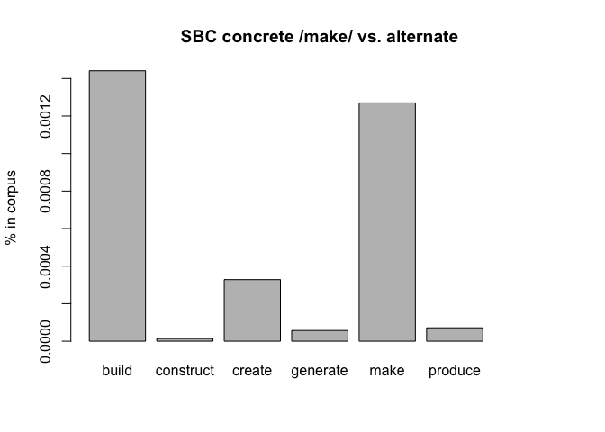

-   [1 term paper draft](#term-paper-draft){#toc-term-paper-draft}
    -   [1.1 init](#init){#toc-init}
    -   [1.2 method](#method){#toc-method}
        -   [1.2.1 corpus sample](#corpus-sample){#toc-corpus-sample}
        -   [1.2.2 script used:](#script-used){#toc-script-used}
        -   [1.2.3 process:](#process){#toc-process}
-   [2 B: references](#b-references){#toc-b-references}

# 1 term paper draft {#term-paper-draft}

topic #6, polysemous verbs with light and concrete senses, replication study of [Mehl (2021)](https://doi.org/10.1515/cllt-2017-0039), further used: [Gilquin (2008)](https://dial.uclouvain.be/pr/boreal/object/boreal:75833)

meta:snc:01,02,3,c1,htm1,md\>htm\>wp,dhpub

## 1.1 init {#init}

“If onomasiological frequency measurements do indeed correlate with elicitation tests, potential impact would be immense. Researchers would be able to examine onomasiological frequencies in spoken corpora rather than performing elicitation tests. That possibility would facilitate cognitive research into languages and varieties around the world, without the necessity of in situ psycholinguistic testing, and would also encourage the creation of more spoken corpora.” ([Mehl (2021) p.23](https://doi.org/10.1515/cllt-2017-0039))

## 1.2 method {#method}

following corpus was used to determine frequencies:

Q.1: Santa Barbara corpus of spoken American English, ([UCSB et al. (2005)](https://www.linguistics.ucsb.edu/research/santa-barbara-corpus))

the corpus data was downloaded from: <https://www.linguistics.ucsb.edu/sites/secure.lsit.ucsb.edu.ling.d7/files/sitefiles/research/SBC/SBCorpus.zip>

### 1.2.1 corpus sample {#corpus-sample}

|         | scb |   id | text                                                  |   lfd | light | alt     |
|:-------|-------:|-------:|:--------------------------|-------:|-------:|:-------|
| 2974    |   3 |  242 | \% I wanted it to be home made Q .                    |  2974 |     0 | make    |
| 65343   |  57 |  123 | … It’s gonna get messed up.                           | 65343 |    NA | a-other |
| 36022   |  31 |  811 | 3is no3 t built,                                      | 36022 |     0 | build   |
| 22225   |  17 | 1011 | H … Chaos X I guess X is basically analysis of noise. | 22225 |    NA | a-other |
| 61913   |  53 |  604 | and make the payroll,                                 | 61913 |     1 | make    |
| 65343.1 |  57 |  123 | … It’s gonna get messed up.                           | 65343 |    NA | a-other |
| 44860   |  38 |  580 | H and the new building is a new visitors center.      | 44860 |     0 | build   |

### 1.2.2 script used: {#script-used}

[14015.concrete-abstract_HA.R](https://github.com/esteeschwarz/SPUND-LX/blob/main/corpusLX/14015-HA/14015.concrete-abstract_HA.R)

### 1.2.3 process: {#process}

#### 1.2.3.1 distribution analysis {#distribution-analysis}

cf. (Mehl 2021, 11–14)

|          | ICE.written | ICE.spoken | SBC.spoken |
|:---------|------------:|-----------:|-----------:|
| concrete |          68 |         96 |         89 |
| light    |         321 |        353 |        381 |

<figure>

<figcaption aria-hidden="true">

distribution of lemma /make/ over corpora. ICE data from study.

</figcaption>

</figure>

#### 1.2.3.2 semantic alternatives to make {#semantic-alternatives-to-make}

this contrast includes made up alternatives to /make/ that Mehl defined in his study. we do not account for the context of these alternatives in the corpus texts, i.e. all occurences are counted. Mehl contrasted only these alternate occurences which “are defined as those verbs that occur in the corpus with the same concrete direct objects as make, (take, and give,) and with a roughly equivalent meaning.” Mehl puts these under “onomasiological alternates”. (cf. Mehl (2021) p.13)

| Var1      | Freq |
|:----------|-----:|
| build     |  101 |
| construct |    1 |
| create    |   23 |
| generate  |    4 |
| make      |   89 |
| produce   |    5 |

semantic alternatives

<figure>

<figcaption aria-hidden="true">

proportion of semantic alternatives to concrete /make/ in SBC

</figcaption>

</figure>

<figure>

<figcaption aria-hidden="true">

proportion of semantic alternatives, only equivalent meaning of alternates

</figcaption>

</figure>

------------------------------------------------------------------------

# 2 B: references {#b-references .unnumbered}

::: {#refs .references .csl-bib-body .hanging-indent markdown="1"}
::: {#ref-gilquin_what_2008 .csl-entry markdown="1"}
Gilquin, Gaëtanelle. 2008. “What You Think Ain’t What You Get: Highly Polysemous Verbs in Mind and Language.” <https://dial.uclouvain.be/pr/boreal/object/boreal:75833>.
:::

::: {#ref-mehl_what_2021 .csl-entry markdown="1"}
Mehl, Seth. 2021. “What We Talk about When We Talk about Corpus Frequency: The Example of Polysemous Verbs with Light and Concrete Senses.” *Corpus Linguistics and Linguistic Theory* 17 (1): 223–47. <https://doi.org/10.1515/cllt-2017-0039>.
:::

::: {#ref-ucsb_santa_2005 .csl-entry markdown="1"}
UCSB, John W. DuBois, L. Chafe Wallace, Charles Meyer, Sandra A. Thompson, Robert Englebretson, and Nii Martey. 2005. “Santa Barbara Corpus of Spoken American English Department of Linguistics - UC Santa Barbara.” *SBC*. <https://www.linguistics.ucsb.edu/research/santa-barbara-corpus>.
:::
:::
