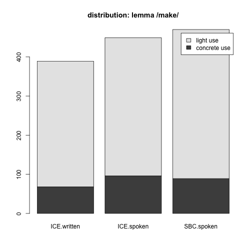
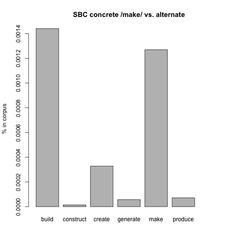
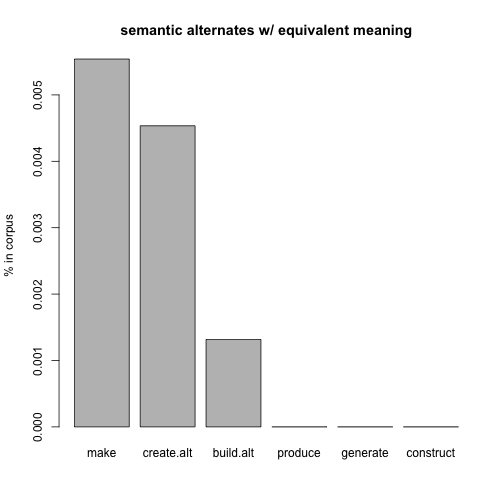

# term paper draft
topic #6, polysemous verbs with light and concrete senses, replication study of 
[@mehl_what_2021](https://doi.org/10.1515/cllt-2017-0039), 
further used [@gilquin_what_2008](https://dial.uclouvain.be/pr/boreal/object/boreal:75833)   

meta.snc.rmd>md>wp

## init
"If onomasiological frequency measurements do indeed correlate with elicitation tests, potential impact would be immense. Researchers would be able to examine onomasiological frequencies in spoken corpora rather than performing elicitation tests. That possibility would facilitate cognitive research into languages and varieties around the world, without the necessity of in situ psycholinguistic testing, and would also encourage the creation of more spoken corpora." 
([@mehl_what_2021 p.23](https://doi.org/10.1515/cllt-2017-0039))

## method
following corpus was used to determine frequencies:   

Q.1: Santa Barbara corpus of spoken American English, ([@ucsb_santa_2005](https://www.linguistics.ucsb.edu/research/santa-barbara-corpus))

the corpus data was downloaded from: [https://www.linguistics.ucsb.edu/sites/secure.lsit.ucsb.edu.ling.d7/files/sitefiles/research/SBC/SBCorpus.zip](https://www.linguistics.ucsb.edu/sites/secure.lsit.ucsb.edu.ling.d7/files/sitefiles/research/SBC/SBCorpus.zip)

### corpus sample

|      | scb|  id|text                                               |   lfd| light|alt     |
|:-----|---:|---:|:--------------------------------------------------|-----:|-----:|:-------|
|2974  |   3| 242|% I wanted it to be  home made Q  .                |  2974|     0|make    |
|65343 |  57| 123|... It's gonna get messed up.                      | 65343|    NA|a-other |
|9465  |   8| 567|and then I didn't and I .. kept making like,       |  9465|     1|make    |
|67928 |  59| 714|And he's  really good at making out .. the budget. | 67928|     1|make    |
|35078 |  30| 612|... God is continually .. building character.      | 35078|     0|build   |
|61913 |  53| 604|and make the payroll,                              | 61913|     1|make    |
|28500 |  24|  25|.. Yeah.                                           | 28500|    NA|a-other |

### script used: 

[14015.concrete-abstract_HA.R](14015.concrete-abstract_HA.R)

### process:
#### distribution analysis 
cf. [@mehl_what_2021 pp.11-14]

|         | ICE.written| ICE.spoken| SBC.spoken|
|:--------|-----------:|----------:|----------:|
|concrete |          68|         96|         89|
|light    |         321|        353|        381|

#### semantic alternatives to make
this contrast includes made up alternatives to /make/ that Mehl defined in his study. we do not account for the context of these alternatives in the corpus texts, i.e. all occurences are counted. Mehl contrasted only these alternate occurences which "are defined as those verbs that occur in the corpus with the same concrete direct objects as make, (take, and give,) and with a roughly equivalent meaning." Mehl puts these under "onomasiological alternates". (cf. @mehl_what_2021 p.13)  

Table: semantic alternatives

|Var1      | Freq|
|:---------|----:|
|build     |  101|
|construct |    1|
|create    |   23|
|generate  |    4|
|make      |   89|
|produce   |    5|

---------

# B: references

