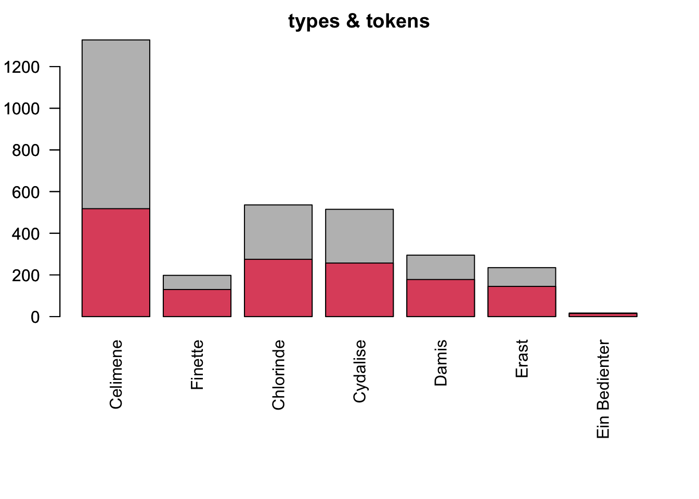

```{r setup, include=FALSE}
knitr::opts_chunk$set(echo = FALSE)
library(readr)
```

## intro
I will show you in a few steps an example workflow of how to prepare some base documents of historic sources that enable further analysis of a dramatic text.     
assumed we start with a plain text file, a lot of work had been done by others yet and we can proceed to the TEI refactoring of the text.   
if we do not have a text file yet, first will be to transcribe some source of the text, usually a .pdf or collection of .jpegs like the following...

## this:


## transcription
for that purpose you can either transcribe the text manually, from picture to text, or you use e.g. *TRANSKRIBUS* [@read-coop_transkribus_2022], a user friendly framework for OCR (optical character recognition). with that half of the work is done by the algorithm, but you still have to check the automatic transcription for recognition failures depending on the quality and the typography of the source.

## editing
next step if you have the transcript ready will be to upload the text page by page to *WIKISOURCE* [@wikimedia_wikisource_nodate] where it can be proofread by others. if theres two correction runs ready, you can download the proper version of the text from which we proceed to the TEI.

## TEI:why
- FAIR-Prinzipien für Daten: findable, accessible, interoperable, reusable
- TEI: text encoding initiative [@tei_history_1987]

theres multiple ways of how you can get to the TEI text. one is to wrap text elements which need to be marked up with *OXYGEN*, a powerful XML editor.

## TEI:refactoring
in our drama class, we used a python script *(JUPYTER-notebook)* written by a friendly geek which allowed easily transforming the preprocessed text into the desired format. 

## basic auszeichnung:
``` {r}
#sampletxt<-readLines("sample.txt")
#print(sampletxt)
```
```
@title Ham 
@subtitle A tragedy
@author William S
^Dramatis Personae
Ham
Egg
Vikings
#Act 1
##Scene 1
@Ham: 
Lovely Spam! 
@Egg: 
Wonderful Spam!
##Scene 2
$Enter Vikings
@Ham: 
Egg, Spam, Sausage, and Bacon! 
@Vikings (singing):
Spam, Spam, Spam, Spam, Spam, Spam, Spam, and Spam
$The end
```


## finalise
if all that is done you possess a finalized TEI text which allows further analysis of the drama again e.g. using python or R for network, semantic etc. analyses.
 

## or linguistic basics

```{r echo=F,warning=F}
posdf<-read.csv("lessing-galotti_PoStagged.csv")
library(knitr)
kable(head(posdf))
```

## Slide with R Output

```{r cars, echo = TRUE}
summary(cars)
```

## Slide with Plot

```{r pressure}
plot(pressure)
```

