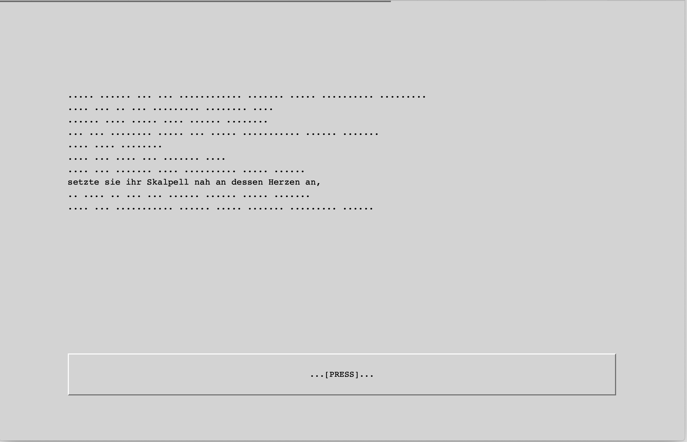

```{r setup, include=FALSE}
knitr::opts_chunk$set(echo = TRUE)
knitr::opts_chunk$set(fig.pos = "H")
#knitr::opts_knit$set("out.format"="html")
#knitr::opts_knit$get("out.format"="html")

Sys.setlocale('LC_ALL', "en_US.UTF-8")
html_t<-knitr::is_html_output()
pdf_t<-knitr::is_latex_output()

```

```{r eval=TRUE, echo=FALSE, warning=FALSE,message=FALSE}
library(httr)
library(knitr)
library(R.utils)
library(stringi)
library(plotly)
#fetch zotero .bib online
#share <- runif(1)
zt<-GET("https://api.zotero.org/groups/4713246/collections/WH6F6HZB/items/top?format=bibtex")

bib<-content(zt,"text")
ybib<-tempfile("ref",fileext = ".bib")
writeLines(bib,ybib)
```

---
bibliography: "`r ybib`"
---

```{r eval=TRUE, echo=FALSE, warning=FALSE,message=FALSE}
source("https://github.com/esteeschwarz/DH_essais/raw/main/sections/hux2021/hux_HA/hux_ha_src.R")

################

# source("hux_ha_src_sel.R")

mchar<-median(dta$char)
  s<-subset(dta,dta$group!="ZFIL")
mitemu<-unique(s$itemId)
mitem<-data.frame(item=mitemu,length=0)
itarray<-array()
k<-1
for (k in 1:length(mitemu)){  
  s<-subset(s,s$itemId==mitemu[k])
  itarray[k]<-sum(s$char[s$itemId==mitemu[k]],na.rm = T)
 # s2<-subset(s,unique(s$string))
#  itarray[k]<-sum(dta$char[dta$itemId==mitemu[k]&dta$group!="ZFIL"],na.rm = T)

#  mitem$length[k]<-sum(dta$char[dta$itemId==mitemu[k]],na.rm = T)
}
# ptemu<-unique(dta$regionId)
# ptem<-data.frame(region=ptemu,length=0)
# parray<-array()
# for (k in 1:length(ptemu)){  
#   parray[k]<-sum(dta$char[dta$regionId==ptemu[k]],na.rm = T)
# 
# #  mitem$length[k]<-sum(dta$char[dta$itemId==mitemu[k]],na.rm = T)
# }
#median(parray)
#median(itarray)
# print(pdf_t)
# print(html_t)
```
---
to read the RMarkdown source with all computations to this document in RStudio cf. [@schwarz_rmarkdown_2021](https://github.com/esteeschwarz/DH_essais/blob/main/sections/hux2021/hux_HA/hux_ha_main.Rmd) 
---

# draft abstract

Ich werde in dieser Arbeit den Versuch unternehmen, ein im Rahmen empirischer Studien durchgeführtes [psycholinguistisches Experiment](https://github.com/esteeschwarz/essais/docs/hux2021) ausführlich zu dokumentieren.    Die Studie wurde in einem Forschungsseminar der BUA[^1] in Kooperation Studierender von FU, TU, HU unter der Aufsicht der Charite durchgeführt. Es handelt sich in diesem Teil um die partielle Replikation des von Paula Rubio-Fernandez [@rubio-fernandez_are_2016] unternommenen Versuchs, das Metaphernverständnis von schizophrenen Personen zu untersuchen. Dazu wurde in der Kontrollgruppe ein *self paced reading* Experiment veranstaltet und ausgewertet. 

# Zum Experiment 
Das Experiment hat in einer Laufzeit von zwei Wochen Daten von 46 Versuchspersonen erhoben, die hauptsächlich in der Statistiksprache R ausgewertet wurden. Basis der Daten ist die Messung von Lesezeiten in einem set von 24 items[^2], die in vierfacher Ausprägung literale und figurative Elemente in kurzen Zusammenhängen verbanden. 

# Theorierahmen
Mit Carston [@carston_xiii-metaphor_2010] sind wir davon ausgegangen, dasz im Experiment zu untersuchende *single* (SM = Metapher eingebettet in literalen Kontext) und *extended metaphors* (EM = erweiterte Metapher, eingebettet in weitgehend figurativen Kontext) unterschiedlich verarbeitet werden, wobei durch die notwendige Aktivierung und Reaktivierung der literalen Bedeutung (ad hoc concept) an SM ein höherer Aufwand nötig sei, der im Gegensatz zu EM in einer längeren Lesezeit resultiert. Diese Annahme führt zu folgenden Fragestellungen, die in Anlehnung an ein Experiment (Verifikation/Replikation) von Paula Rubio-Fernandez et al. [@rubio-fernandez_are_2016] hier aufgenommen wurden:   

1. unterscheiden sich die Lesezeiten kurzer Texte, die nach den Annahmen folgendem Muster single und extended metaphors enthalten oder rein literal (LC) aufgebaut sind?   
2. wie unterscheidet sich eine vierte Variante, bei der die Struktur der SM invertiert wurde (ISM = literales Element eingebettet in weitgehend figurativen Kontext), hinsichtlich ihrer Verarbeitungszeit?

Die zu überprüfenden Hypothesen lauten wie folgt:   

1.  Lesezeit SM > Lesezeit EM   
2.  Lesezeit EM = Lesezeit LC   
3.  Lesezeit ISM = SM > EM = LC   

Zur Überprüfung der Hypothesen wurde ein *self paced reading* Experiment durchgeführt, das die Lesezeit in den unterschiedlichen Kategorien erfasste. 


# Dokumentation
Ich werde im Folgenden den Aufbau und Ablauf des Experiments erklären und im nächsten Abschnitt dessen hypothesengeleitete Auswertung erläutern. 

## Design 
Die Versuchspersonen bekamen während des Tests, der online über einen link abrufbar war, ein set aus jeweils 8 items (Kontexte) die wiederum die Varianten der Variable (Einbettung der Metapher) in Ausprägungen von   

- LC (Metapher literal in literalem Kontext)   
- SM (Metapher figurativ in literalem Kontext)   
- EM (Metapher figurativ in figurativem Kontext)  
- ISM (Metapher literal in figurativem Kontext)    

enthielten sowie einen Bestand aus 16 filler items, die sich ebenfalls in den Kontextvarianten unterschieden. Die Probandinnen lasen einen Text, von dem jeweils nur eine Zeile nicht maskiert war, die jeweils folgende Zeile wurde durch das Drücken der Leertaste sichtbar. So konnte die Verweildauer auf einer sichtbaren Zeile gemessen werden. Als Grundlage für die Messung wurde ein von [@rose_jespr_2022] frei verfügbares javascript benutzt, das an unsere Bedürfnisse angepasst worden war; u.a. war ursprünglich keine dauerhafte Speicherung der Daten in einer Datei vorgesehen, diese Funktion wurde von mir [mit einigem Aufwand realisiert](https://github.com/esteeschwarz/essais/tree/main/docs/hux2021/experiment/JESPR_original%26modified), so dasz die Lesezeiten danach in einer Tabelle verfügbar waren.    
Die Einbettung des Experiments in einen auf der Plattform [soscisurvey](https://soscisurvey.de) als akademische Studie angemeldeten Fragebogen erforderte ebenfalls einigen Aufwand, da die Randomisierung der Itemabfrage in anderer Weise als vom script vorgesehen geschehen muszte.   
Die Daten selbst enthielten Werte für:   

- den Start und Endzeitpunkt des durchgeführten Tests (tnid)   
- die Position der einzelnen maskierten Phrasen im Satz (targetposition) (unabhängige Variable)   
- die Verweildauer auf den jeweiligen Positionen (elapsed time) (abhängige Variable)   
- Angaben über die Zuordnung der Phrasen zur jeweiligen Ausprägung (Kategorie) der unabhängigen Variablen

## Zum Inhalt des Tests

Die items, die in Anlehnung an R/F nach obigem Muster von uns entworfen wurden, entsprachen im Aufbau dem set, das R/F in ihrem Test verwendet hatte; vier ihrer im Anhang zur Verfügung gestellten items hatten wir ins deutsche übersetzt und eines davon als item in vier Varianten, die restlichen als filler übernommen. Die Auswahl der verwendeten items wurde gemeinschaftlich nach Kriterien wie Konsistenz innerhalb der items, Stil und Kohärenz bestimmt. Ebenfalls nach den constraints von R/F gerichtete Vorgaben wie Wort- und Phrasenlänge (`median characters/phrase =` ```r mchar```), Itemlänge und Position des targets hatten beim Entwurf eine wichtige Rolle gespielt, waren jedoch nicht immer optimal umgesetzt worden; dazu einige Bemerkungen im Auswertungsteil. Ein item sollte eine Metapher in je figurativer und literaler Bedeutung, eingebettet in einen je figurativen oder literalen Kontext, d.h. also in insgesamt vier unterschiedlichen Konfigurationen, präsentieren. Die Metapher (unser target) sollte sich im dritten Viertel des Kontextes befinden, um davor und danach auftretende Latenzen der Lesezeit auswerten zu können. Dafür wurden im script des Tests die Positionen der einzeln zu lesenden Phrasen des items mit 0 für das target und je negativen und positiven Werten für den Abstand zum target festgelegt.[^3]   
Das set eines einzelnen durch Abruf des Fragebogens aufgerufenen Tests bestand für jede Studienteilnehmerin aus einer randomisierten Auswahl einer von vier mal acht Itemvarianten (aus der Menge von 8 items), womit jeweils zweifach Meszdaten der vier Varianten pro TN erhoben werden konnten, aber niemals ein TN ein item in mehreren Varianten las. 
Die 16 filler items traten innerhalb des sets aus also 24 items an zufälligen Positionen auf, wurden aber bei allen TN aus demselben pool bedient und wiesen ausgeglichene Variation hinsichtlich der figurativ-literalen Konfiguration auf.


## Auswertung

O.a. Daten wurden in R [@rstudio_rstudio_2022] 1. deskriptiv und 2. mittels des Paketes lme4 [@bates_fitting_2015] zur Erhebung kovariater Abhängigkeiten (linear mixed model) analog der Vorgaben [@rubio-fernandez_are_2016] ausgewertet. Das script dazu kann [hier](https://github.com/esteeschwarz/essais/tree/main/docs/hux2021/evaluation), sowie eine visualisierte, vom user nach eigenen Parametern anzupassende deskriptive Auswertung [hier](https://vision2020.shinyapps.io/hux2021) nachvollzogen werden. Für eine ausschnitthafte Visualisierung cf. (Figure \@ref(fig:fig-01), \@ref(fig:fig-02), \@ref(fig:fig-03)).


### a. 
Zur Auswertung wurden die erhobenen durch ein php-script im flachen comma-separated Format gespeicherten Lesezeiten in R importiert. Um zu gewährleisten, dasz Abweichungen hinsichtlich der Zeichenanzahl der zeitgemessenen Phrasen keine unerwünschten Effekte in der Berechnung der Latenzen zeitigen, wurde bei jeder weiteren Berechnung dafür ein von der Zeichenanzahl/Phrase anhängiger Koeffizient einbezogen, der in der ersten, deskriptiven Auswertung einfach aus der Zeichenanzahl, bei der zweiten kovariaten Auswertung mittels lme4 bestimmt [@fine_rapid_2013] und als Residual (hier: korrigierte Lesezeit) einbezogen wurde. R/F hatten ihre Daten mit dem R-package lme4 unter multivariaten Gesichtspunkten analysiert; so konnte auch ich (in dieser Phase ging die Experiment-Arbeitsgruppe getrennte Wege) nach Feststellung des Effekts der Phrasenlänge und Berücksichtigung desselben als korrigierte Lesezeit (hier: die abhängige Variable in der lmer Formel) einen signifikanten Effekt der Itemkategorie auf die Lesezeiten von SM und ISM (im Dataset "MM") feststellen. Bei der Multivarianzanalyse wurden hier ein *main effect* der Kategorie (LC, SM, EM, ISM = group) unter *random effects* von TN (participant) und Kategorie auf TN (group by participant) vorausgesetzt. cf. [@rubio-fernandez_are_2016 p.20]

```{r eval=TRUE, echo=FALSE, warning=FALSE,message=FALSE}
sel1<-c(-1,0,1,1,1,0)
gr1<-"SM"
  other<-"Other"
getdf<-function(selection,groupvsall){

y<-selection
x<-groupvsall
 # source("hux_ha_src_sel.R")

#    y<-mydata
    dset<-now.data(dta,y)     
 #   x<-mydata_2
  
#    dsetvso<-setvsx(dset,x,other)
    bar_df_1<-plot_desc(dset)
 #   bar_df_2<-(plot_desc_compare(dsetvso,x,"All"))
    bar_df_1$group<-gsub("mm","ISM",bar_df_1$group)
    bar_df_1$group<-toupper(bar_df_1$group)
    bar_df_1<-bar_df_1[,2:length(bar_df_1)]
    
    for (g in bar_df_1$group){
      difns<-paste0("dif_",g)

    for (k in 1:length(bar_df_1$LZ)){
    #bar_df_1$dif_sm[k]<-bar_df_1$LZ
    if (bar_df_1$group[k]!=g)
      bar_df_1[k,difns]<-bar_df_1$LZ[k]-bar_df_1$LZ[bar_df_1$group==g&bar_df_1$RT==bar_df_1$RT[k]]
    }
    }
    bar_df_1$LZ<-round(bar_df_1$LZ)
    bar_df_1[,4:7]<-round(bar_df_1[4:7])
    bararr<-c(1,3,2,4:7)
    bar_df_1<-cbind(bar_df_1[bararr])
   # dfrank<-bar_df_1[order(bar_df_1$LZ[bar_df_1$RT=="TI + rtc"],)]
   #  dfrank<-subset(bar_df_1,bar_df_1$RT=="TI + rtc")
   # dfrank<-dfrank[with(dfrank,order(dfrank$LZ,decreasing = F)), ]
}
getdf3<-function(selection,groupvsall){

y<-selection
x<-groupvsall
 # source("hux_ha_src_sel.R")

#    y<-mydata
    dset<-now.data(dta,y)     
 #   x<-mydata_2
  
#    dsetvso<-setvsx(dset,x,other)
    bar_df_1<-plot_desc_md(dset)
 #   bar_df_2<-(plot_desc_compare(dsetvso,x,"All"))
    bar_df_1$group<-gsub("mm","ISM",bar_df_1$group)
    bar_df_1$group<-toupper(bar_df_1$group)
    bar_df_1<-bar_df_1[,2:length(bar_df_1)]
    
    for (g in bar_df_1$group){
      difns<-paste0("dif_",g)

    for (k in 1:length(bar_df_1$LZ)){
    #bar_df_1$dif_sm[k]<-bar_df_1$LZ
    if (bar_df_1$group[k]!=g)
      bar_df_1[k,difns]<-bar_df_1$LZ[k]-bar_df_1$LZ[bar_df_1$group==g&bar_df_1$RT==bar_df_1$RT[k]]
    }
    }
    bar_df_1$LZ<-round(bar_df_1$LZ)
    bar_df_1[,4:7]<-round(bar_df_1[4:7])
    bararr<-c(1,3,2,4:7)
    bar_df_1<-cbind(bar_df_1[bararr])
   # dfrank<-bar_df_1[order(bar_df_1$LZ[bar_df_1$RT=="TI + rtc"],)]
   #  dfrank<-subset(bar_df_1,bar_df_1$RT=="TI + rtc")
   # dfrank<-dfrank[with(dfrank,order(dfrank$LZ,decreasing = F)), ]
}
getdf2<-function(selection,groupvsall){
y<-selection
x<-groupvsall

      dset<-now.data(dta,y)
    dsetvso<-setvsx(dset,x,other)
#    bar_df_1<-plot_desc(dset)
    bar_df_2<-(plot_desc_compare(dsetvso,x,"All"))

}
  # dfrank<-dfrank[,2:length(dfrank)]
   # dfrank$group[dfrank$group=="MM"]<-"ISM"
   # which.max(dfrank[,4:7])
    #mode(dfrank[,4:7]^2)
    #mode(bar_df_1)
bar_df_1<-getdf(sel1,gr1)
   dfrank<-subset(bar_df_1,bar_df_1$RT=="TI + rtc")
   dfrank<-dfrank[with(dfrank,order(dfrank$LZ,decreasing = F)), ]

bar_df_2<-getdf2(sel1,gr1)
    df2<-data.frame(dfrank)
    df2[,4:7]<-sqrt(df2[,4:7]^2)
    dfmax<-round(max(as.matrix(df2[,4:7]),na.rm = T),2)
    #mode(df2$dif_SM)
    selection<-sel1
      p1<-ggplot(data=bar_df_1, aes(x=group,y=LZ,fill=RT)) + 
      geom_col(position = "dodge") +  labs(x="groups compared", y="mean reading time", title="reading times according to phrase length correction")
bar_df_3<-getdf3(sel1,gr1)
#bar_df_3
lmeforms<-create_lmeforms(dta,"rtc")
#y<-sel1
sel3<-c(-1,0,1,1,1,1)
    dset<-now.data(dta,sel1)
sum1<-lmer(lmeforms$old[[1]],dset)
s1<-summary(sum1)

s1$coefficients<-s1$coefficients[order(s1$coefficients[,1]),]
s1co<-data.frame(s1$coefficients)
m<-grep("(Intercept)",rownames(s1co))                
rownames(s1co)[m]<-"SM"
ns<-gsub("XvsGr[0-9]","",rownames(s1co))
m<-grep("MM",ns)
ns[m]<-"ISM"
#s1co<-data.frame(s1$coefficients)
rownames(s1co)<-ns
#s1co

```


### b.
Deskriptiv konnten am target keine signifikanten Unterschiede in der durchschnittlichen Lesezeit an den verschieden eingebetteten Metaphern festgestellt werden. Da mir noch wesentliche Grundlagen zur Interpretation der Ergebnisse der Multivarianzanalyse fehlen und es sich hier nur um die kurze Dokumentation des Experiments im Seminarkontext handeln soll, die endlich abgeschlossen werden soll, werde ich darauf verzichten, meine Ergebnisse der multivariaten Berechnungen zur Grundlage einer dadurch ansatzweisen Bestätigung der 2. und 3. Hypothesen (ISM > LC = EM) zu stilisieren. Sie seien hier jedoch kurz angeführt - die Hierarchie der Lesezeiten wäre dann (model estimates) wie folgt zu lesen:  `r ns[4]` > `r ns[3]` = `r ns[2]` > `r ns[1]`, in Kontrast zur Hypothese ISM = SM > EM = LC  (cf. lmer summary):  

```{r eval=TRUE, echo=FALSE, warning=FALSE,message=FALSE}
print(lmeforms$old[[1]])
s1
```
### c.
Grob liesze sich durch die allein deskriptive Auswertung die Aussage machen, dasz sich bei target = `r selection[1:3]`, Vernachlässigung ungültiger Fälle = `r selection[4]`, outliers discarded = `r selection[5]` & korrigierter RT (selection = `r selection`) folgende Hierarchie der Lesezeiten ergibt:    
`r dfrank$group[4]` > `r dfrank$group[3]` > `r dfrank$group[2]` > `r dfrank$group[1]`. Dabei gilt es zu beachten, dasz der hier gröszte Unterschied der zwischen `r dfrank$group[1]` und `r dfrank$group[4]` mit `r dfmax`ms zu messen ist, übersetzt unterhalb einer halben Sekunde liegt. (Zum Vergleich: ein ununterbrochenes Weiterklicken der lesbaren Zeilen mittels der space-Taste zeigt ca. 200ms Latenz.)    
Siehe dazu den Ausschnitt `TI + rtc` = length corrected reading time

```{r fig-05, eval=TRUE, echo=FALSE, warning=FALSE,message=FALSE}
kable(dfrank)
```

aus der folgenden Tabelle:[^4]

```{r fig-04, eval=TRUE, echo=FALSE, warning=FALSE,message=FALSE}
kable(bar_df_1)
```

```{r eval=TRUE, echo=FALSE, warning=FALSE,message=FALSE}
sel2<-c(0,0,0,1,1,0)
gr2<-"SM"
bar_df_1<-getdf(sel2,gr2)
dfrank<-subset(bar_df_1,bar_df_1$RT=="TI + rtc")
dfrank<-dfrank[with(dfrank,order(dfrank$LZ,decreasing = F)), ]
bar_df_2<-getdf2(sel2,gr2)
selection<-sel2
df2<-data.frame(dfrank)
df2[,4:7]<-sqrt(df2[,4:7]^2)
dfmax<-round(max(as.matrix(df2[,4:7]),na.rm = T),2)
 
```

Bei isoliertem target (target = `r selection[1:3]`) ergibt sich folgende Hierarchie der Lesezeiten:    
`r dfrank$group[1]` < `r dfrank$group[2]` < `r dfrank$group[3]` < `r dfrank$group[4]` mit dem gröszten Unterschied zwischen `r dfrank$group[1]` und `r dfrank$group[4]` mit `r dfmax`ms. 

```{r fig-06, eval=TRUE, echo=FALSE, warning=FALSE,message=FALSE}
kable(dfrank)
```

### d. LEGENDE    

- **LZ:** berechnete Lesezeit (response time)
- **TimeInterval:** uncorrected response time (TI)   
- **TI + RTC:** TimeInterval + lmer residuals of TI dependent on phrase length   
- **TI char:** TimeInterval corrected by mean phrase length (TI/characters*mean(characters))   

### p. visuals

```{r fig-01, eval=TRUE, echo=FALSE, warning=FALSE,message=FALSE, fig.cap="evaluate target, target-preceding, target-following phrase, not length corrected"}
  #  x<-mydata_2
x<-gr1
    #print(x)
    other<-"Other"
    #y<-mydata()
   # y<-mydata
    y<-sel1
    dset<-now.data(dta,y)
    #print(dim(dset))
    dsetvso<-setvsx(dset,x,other)
    #print(dim(dsetvso))
    #print(unique(dsetvso$category))
    #print(plot_desc_compare(dsetvso,x,"All"))
    # bar_df<-cbind(dsetvso$timeinterval[group!=other],dsetvso$timeinterval[group==other])
    xlab<-paste("target:",sel1[1:3],collapse = " ")
 boxplot(dset$speed~group,outline=F, notch=T,range=0.4,main="reading speed / phrase & group",xlab=paste0("observations limited to ",xlab),ylab = "speed (char/ms)")
 #      p2<-ggplot(data=dset, aes(x=group,y=speed)) + add_boxplot() 
#       # geom_col(position = "dodge") +  labs(x="groups compared", y="mean reading time", title="reading times over groups")
# ggplotly(p2)
 speed<-dset$timeinterval
```


```{r fig-02, eval=TRUE, echo=FALSE, warning=FALSE,message=FALSE,fig.cap="reading times (uncorrected = timeinterval) and with 2 different approaches of processing the phrase length"}
    #     p<-ggplot(data=bar_df_1, aes(x=group,y=LZ,fill=RT)) + 
    #   geom_col(position = "dodge")
    # # p +  labs(x="groups compared", y="mean reading time", title="reading times according to phrase length correction")
 p2<-ggplot(data=bar_df_1, aes(x=group,y=LZ,fill=RT)) + 
      geom_col(position = "dodge") +  labs(x="groups compared", y="mean reading time", title="reading times according to phrase length correction")
pdf<-F
html<-T
#ifelse(html_t==F,pdf<-T,html<-F)
# if (pdf_t==T){
#   p2}
p2
# cat("html= ",html_t,"\n")
# cat("pdf= ",pdf_t)
#if(html_t==T){ggplotly(p2)}
#if(html_t==T){ggplotly(p2)}
#if(html_t==F){p2}
#html
```


```{r fig-03, eval=TRUE, echo=FALSE, warning=FALSE,message=FALSE,fig.cap="comparing SM vs. other"}
    

p3<-ggplot(data=bar_df_2, aes(x=group,y=LZ,fill=RT)) +
  geom_col(position = "dodge") +  labs(x="group vs. All", y="mean reading time", title="compare group vs. All")
html<-T
pdf<-F
# ifelse(html_t==F,pdf<-T,html<-F)
# placeholder<-paste("placeholder for floating images in pdf output ",1:13,sep  = " ")
# if (pdf_t==T){
#  # print(placeholder)
#   p3
# }
p3
 # if(html_t==T){ggplotly(p3)}
# if(html_t==F){p3}

```

## Studienansicht des Experiments
cf. (Figure 4)    

wenn Sie sich in der .pdf-Ausgabe der Arbeit befinden, können Sie
[hier](https://ada-sub.dh-index.org/school/papers/014/ext/index.html) die Ansicht aufrufen.



sonst hier ein Auszug aus der verwendeten Version, der im .pdf nicht erscheint.
```{=html}
<iframe src='https://ada-sub.dh-index.org/school/papers/014/ext/index.html' height='800px' width='100%' style="border:1px solid black;"></iframe>
```


[^1]:	Berlin University Alliance

[^2]:	*item* hier als ein in vier Ausprägungen entworfener Text mit durchschnittlicher Länge von 400 Zeichen.

[^3]:	da diese Positionen erst :nach: Start des Tests konsequent im script festgelegt wurden, muszte bei der Auswertung einiges manuell nachgearbeitet werden, um die Daten konsistent zu halten.

[^4]: Für weitere Ansichten und Studiensample besuchen Sie bitte [o.a. interaktive Visualisierungen](https://vision2020.shinyapps.io/hux2021).


------------------------------------------------------------------------

# B. REF:


